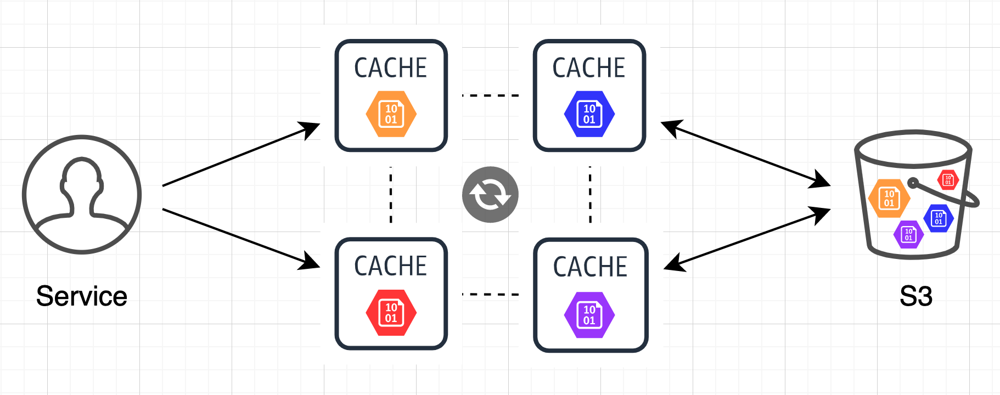

# Cachenator

[](https://github.com/MarshallWace/cachenator/actions?query=workflow%3A%22Publish+Docker%22) [](https://goreportcard.com/report/github.com/MarshallWace/cachenator)

Distributed, sharded in-memory cache and proxy for S3.

Features:

- Horizontal scaling and clustering
- Read-through blob cache with TTL
- Batch parallel uploads and deletes
- Max memory limits with LRU evictions
- Fast cache keys invalidation
- Async cache pre-warming with keys prefix
- Prometheus metrics
- Access multiple S3 endpoints (on-prem + AWS) (soon)



---

## Run

```
$ docker run -it ghcr.io/marshallwace/cachenator --help
Usage of /cachenator:
  -host string
    	Host/IP to identify self in peers list (default "localhost")
  -max-cache-size int
    	Max cache size in megabytes. If size goes above, oldest keys will be evicted (default 512)
  -max-multipart-memory int
    	Max memory in megabytes for /upload multipart form parsing (default 128)
  -metrics-port int
    	Prometheus metrics port (default 9095)
  -peers string
    	Peers (default '', e.g. 'http://peer1:8080,http://peer2:8080')
  -port int
    	Server port (default 8080)
  -s3-download-concurrency int
    	Number of goroutines to spin up when downloading blob chunks from S3 (default 10)
  -s3-download-part-size int
    	Size in megabytes to request from S3 for each blob chunk (minimum 5) (default 5)
  -s3-endpoint string
    	Custom S3 endpoint URL (defaults to AWS)
  -s3-force-path-style
    	Force S3 path bucket addressing (endpoint/bucket/key vs. bucket.endpoint/key) (default false)
  -s3-upload-concurrency int
    	Number of goroutines to spin up when uploading blob chunks to S3 (default 10)
  -s3-upload-part-size int
    	Buffer size in megabytes when uploading blob chunks to S3 (minimum 5) (default 5)
  -timeout int
    	Get blob timeout in milliseconds (default 5000)
  -ttl int
    	Blob time-to-live in cache in minutes (default 60)
  -verbose
    	Verbose logs
  -version
    	Version

$ docker run -d --name cache1 --network host -v $HOME/.aws/:/root/.aws:ro ghcr.io/marshallwace/cachenator \
  --port 8080 --metrics-port 9095 \
  --peers http://localhost:8080,http://localhost:8081,http://localhost:8082

$ docker run -d --name cache2 --network host -v $HOME/.aws/:/root/.aws:ro ghcr.io/marshallwace/cachenator \
  --port 8081 --metrics-port 9096 \
  --peers http://localhost:8080,http://localhost:8081,http://localhost:8082

$ docker run -d --name cache3 --network host -v $HOME/.aws/:/root/.aws:ro ghcr.io/marshallwace/cachenator \
  --port 8082 --metrics-port 9097 \
  --peers http://localhost:8080,http://localhost:8081,http://localhost:8082
```

## Use

```bash
##########
# Upload #
##########

curl "http://localhost:8080/upload?bucket=bucket1" \
  -F "files=@blob1"

curl "http://localhost:8080/upload?bucket=bucket1&path=folder" \
  -F "files=@blob2" \
  -F "files=@blob3" \
  -F "files=@blob4"

#######
# Get #
#######

# First request fills cache from S3
curl "http://localhost:8080/get?bucket=bucket1&key=blob1" > blob1

# 2nd+ requests served from memory
curl "http://localhost:8080/get?bucket=bucket1&key=blob1" > blob1

# Hitting other nodes will get the blob from the shard owner and cache it as well before returning
curl "http://localhost:8081/get?bucket=bucket1&key=blob1" > blob1
curl "http://localhost:8082/get?bucket=bucket1&key=blob1" > blob1

########
# List #
########

curl "http://localhost:8080/list?bucket=bucket1&prefix=folder" | jq '.keys'

############
# Pre-warm #
############

# Pre-pull in the background and cache keys 'folder/[blob2/blob3/blob4]'
curl -XPOST "http://localhost:8080/prewarm?bucket=bucket1&prefix=folder/blob"

# Served straight from memory
curl "http://localhost:8080/get?bucket=bucket1&key=folder/blob2" > blob2

##############
# Invalidate #
##############

# Remove blob1 from memory on all nodes
curl -XPOST "http://localhost:8080/invalidate?bucket=bucket1&key=blob1"

##########
# Delete #
##########

# Delete only blob1 from S3
curl -XDELETE "http://localhost:8080/delete?bucket=bucket1&key=blob1"

# Delete keys 'folder/[blob2/blob3/blob4]' from S3
curl -XDELETE "http://localhost:8080/delete?bucket=bucket1&prefix=folder/blob"

###########
# Metrics #
###########

curl "http://localhost:9095/metrics"
```
